  

    
    
    
    

  

---

## 👨‍💻 About Me

I am a Computer Science graduate from Patuakhali Science and Technology University and currently pursuing M.Sc. Engg. in Information and Communication Technology at Bangladesh University of Engineering and Technology.

My core expertise lies in **Software Engineering, Systems Design, Applied Artificial Intelligence, and Competitive Programming**. I thrive on architecting scalable software systems, developing AI-driven solutions, and pushing the boundaries of machine learning research. 

- 🚀 Passionate about building high-performance backend systems and complete full-stack SaaS platforms.
- 🏆 3-time ICPC Asia Dhaka Regionalist and NCPC 2023 Finalist.
- 💡 Solved 2600+ algorithmic problems across various online judges.
- 📚 Published researcher in IEEE Xplore with a focus on Deep Learning and Imbalanced Classification.

---

## 🛠️ Technical Skills & Stack

  <strong>Languages:</strong> 
  

  <strong>Frontend & Full-Stack:</strong> 
  

  <strong>Backend, Databases & DevOps:</strong> 
  

  <strong>AI & Research:</strong> 
  

---

## 🚀 Featured Software Engineering Projects

### ⚡ TurboCache-Cpp
A high-performance, multi-threaded in-memory caching system (a Mini Redis) built entirely from scratch in **C++17**.
- **Tech Stack:** Raw C++, Winsock2 API, Thread Pool, Readers-Writer Locks (`std::shared_mutex`).
- **Features:** Custom TCP server handling concurrent connections efficiently without bloated frameworks, executing real-time RESP-like commands (`SET`, `GET`, `DEL`, `DBSIZE`).
- **Repository:** [almuzahidseyam/TurboCache-Cpp](https://github.com/almuzahidseyam/TurboCache-Cpp)

### 🤖 Multi-Agent Dev Team
An autonomous TypeScript CLI platform where three AI agents (Planner, Coder, Reviewer) collaboratively build software projects in the terminal.
- **Tech Stack:** Node.js, TypeScript, Gemini API, Chalk, Ora.
- **Features:** Multi-agent pipeline orchestrating requirement analysis, automated code generation, and rigorous bug reviewing natively in the filesystem.
- **Repository:** [almuzahidseyam/multi-agent-dev-team](https://github.com/almuzahidseyam/multi-agent-dev-team)

### 📧 ProfEmail SaaS
A modern SaaS web platform designed to help researchers parse their CVs and automatically generate highly tailored cold emails for university professors.
- **Tech Stack:** Next.js, Tailwind CSS, Gemini 2.5 Flash, Native PDF parsing.
- **Features:** AI-powered context extraction from PDFs, customizable prompt parameters, and responsive UI.
- **Repository:** [almuzahidseyam/profemail-saas](https://github.com/almuzahidseyam/profemail-saas)

### 📊 CF AI Analyzer
An AI-powered Codeforces assistant that intelligently analyzes a user's failed submissions to recommend targeted algorithmic practice.
- **Tech Stack:** Next.js, React, Codeforces Official API, AI Integration.
- **Features:** Fetches exact WA/TLE submissions, deduces weak concepts (e.g., DP, Graph Theory), and provides a personalized improvement roadmap.
- **Repository:** [almuzahidseyam/cf-ai-analyzer](https://github.com/almuzahidseyam/cf-ai-analyzer)

### 💻 Brainsoft-OJ
A remarkable, local-first Online Judge platform for competitive programming and algorithm practice.
- **Tech Stack:** React, Node.js, SQLite, C++ STL, Python, Java.
- **Features:** Real-time sandboxed code execution, Monaco in-browser editor, zero-config database architecture.
- **Repository:** [almuzahidseyam/Brainsoft-OJ](https://github.com/almuzahidseyam/Brainsoft-OJ)

---

## 🏆 Competitive Programming

- **Codeforces:** Pupil (Max rating: 1376)
- **CodeChef:** 3 Star (Max rating: 1745)
- **AtCoder:** Rating 456
- **BeeCrowd:** Top 1% Global
- **Total Solved:** 2600+ algorithmic problems

**Achievements:**
- ICPC Asia Dhaka Regionalist (2023, 2024, 2025)
- NCPC Finalist (2023)
- 3rd place, PSTU Independence Day Programming Contest (2024)
- National Undergraduate Mathematics Olympiad Awardee

---

## 🔬 Research & Thesis

### DASS: Density-Adaptive Synthetic Sampling for Improved Imbalanced Classification
*Published in IEEE Xplore at the 6th International Conference on Sustainable Technologies for Industry 5.0.*
- **DOI:** [10.1109/STI64222.2024.10951098](https://doi.org/10.1109/STI64222.2024.10951098)
- **Domain:** Machine Learning, Computer Vision, Synthetic Sampling.

### M.Sc. Thesis
*Attention-Driven Hierarchical Active Learning Framework for Robust Imbalanced Classification.*
- **Domain:** Deep Learning, Active Learning, Attention Mechanisms.

---

## 🎓 Education

**Bangladesh University of Engineering and Technology (BUET)**  
M.Sc. Engg. in Information and Communication Technology | *May 2025 – Present*

**Patuakhali Science and Technology University (PSTU)**  
M.Sc. in Computer Science and Information Technology | *Jan 2025 – Apr 2026*  
B.Sc. Engg. in Computer Science and Engineering | *Jan 2019 – Dec 2024*

---

## 📈 GitHub Activity

  <picture>
    <source media="(prefers-color-scheme: dark)" srcset="https://raw.githubusercontent.com/almuzahidseyam/almuzahidseyam/output/github-contribution-grid-snake-dark.svg">
    <source media="(prefers-color-scheme: light)" srcset="https://raw.githubusercontent.com/almuzahidseyam/almuzahidseyam/output/github-contribution-grid-snake.svg">
    
  </picture>

  

  

---

## 📬 Connect With Me

<table align="center">
  <tbody>
    <tr>
      <td style="text-align: center;">
        
      </td>
      <td style="text-align: center;">
        
      </td>
      <td style="text-align: center;">
        
      </td>
      <td style="text-align: center;">
        
      </td>
      <td style="text-align: center;">
        
      </td>
    </tr>
  </tbody>
</table>

---

  <i>Building, learning, solving, and improving one step at a time.</i>

  

